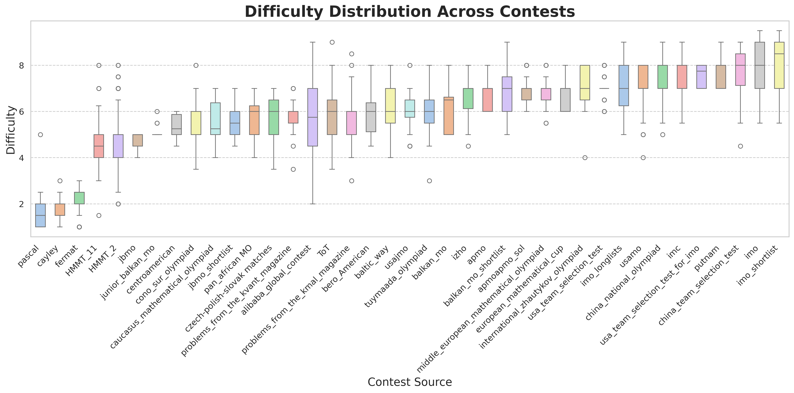

<h1 align="center">
     <br>Omni-MATH
</h1>
<p align="center">
    <a href="https://arxiv.org/abs/2410.07985">
        
    </a>
    <a href="https://huggingface.co/datasets/KbsdJames/Omni-MATH">
        
    </a>
    <a href="https://huggingface.co/KbsdJames/Omni-Judge">
        
    </a>
    <a href="https://omni-math.github.io/">
        
    </a>
</p>


*Omni-MATH is a comprehensive and challenging benchmark specifically designed to assess LLMs' mathematical reasoning at the Olympiad level. Our dataset focuses exclusively on Olympiad mathematics and comprises a vast collection of 4428 competition-level problems. These problems are meticulously categorized into 33 (and potentially more) sub-domains and span across 10 distinct difficulty levels, enabling a nuanced analysis of model performance across various mathematical disciplines and levels of complexity.*


## 🏆 Leaderboard
The leaderboard with detailed metrics please refer to our project page [Omni-MATH](https://omni-math.github.io/).

It is important to note that the latest [**OpenAI o1-mini**](https://openai.com/index/learning-to-reason-with-llms/) achieves a score of **60.5%** on our proposed Omni-MATH benchmark, with an accuracy of **48.56%** for problems rated above a difficulty level of 5 (out of a total of 10). This highlights that challenges in solving olympiad-level mathematics problems remain significant and far from being addressed.

## 🫵🏻 Test your own model
Due to the complexity of high-level mathematical problems and their solutions, designing rule-based evaluation methods can be challenging. For the answer verification, we provide two manner: **GPT4-Evaluation** and **Omni-Judge**. 

**All the results in our leaderboard is obtained using GPT-4o-Evaluation.**

### 1. GPT-4 Evaluation
For GPT4-Evaluation, after obtaining the inference result of your model, you can query GPT-4 to test whether your model's output is correct. We provide our dedicated few-shot prompt for querying GPT model in `GPT_eval/gpt_evaluation_template.txt`. This step will yield a data report for each sample, as illustrated below:
```
## Student Final Answer
2017^{98}

## Equivalence Judgement
TRUE

## Justification
The student's final answer, \(2017^{98}\), matches the reference answer. Both answers indicate the number of ordered arrays \((x_1, \ldots, x_{100})\) that satisfy the given divisibility conditions. Since the student's answer is mathematically equivalent to the reference answer, the meaning conveyed by both is the same.

=== report over ===
```
In this report, `Student Final Answer` represents the final output from your model, `Equivalence Judgement` indicates GPT's assessment of the correctness of your model's output, and `Justification` provides the reasoning behind that judgment.

We have provided examples of GPT model evaluations in the directory `./GPT_eval/examples`. Please format the results from GPT-eval in accordance with the examples provided above. Afterward, you can run `bash ./GPT_eval/get_result.sh` to obtain the overall score for the model, scores in different domains, and scores across various difficulty levels.


### 2. Omni-Judge
Due to the high cost of GPT-4o and its limited accessibility, we retained the evaluation data used for the GPT-4o model and adapted it for instruction tuning.
Omni-Judge builds on the meta-llama/Meta-Llama-3-8B-Instruct, incorporating GPT-4o evaluation data for instruction tuning. The training dataset comprises 21,451 examples, with a total of 2 epochs. Omni-Judge's performance is closely aligned with GPT-4o. We created an internal evaluation set using queries not previously seen by the model, consisting of 2,690 test samples. The agreement rate between Omni-Judge and GPT-4o evaluations is approximately 95%.

For detailed information, please refer to [Omni-Judge](https://huggingface.co/KbsdJames/Omni-Judge).

#### Usage
1. Prepare the model output file with the same format as `./Omni-Judge_eval/examples_infile`.

2. Run the following command and you will yield a outfile which is similar to the `xxx_gpteval.jsonl`, and the metrics like detailed accuracy etc.
```bash
cd ./Omni-Judge_eval
bash omni_judge.sh
```

### 
## 🔍 Detailed Source of Omni-MATH


## 💬 Citation
If you find our work interesting and meaningful, welcome to give a 🌟 to our repo and cite our paper.
```
@misc{gao2024omnimathuniversalolympiadlevel,
      title={Omni-MATH: A Universal Olympiad Level Mathematic Benchmark For Large Language Models}, 
      author={Bofei Gao and Feifan Song and Zhe Yang and Zefan Cai and Yibo Miao and Qingxiu Dong and Lei Li and Chenghao Ma and Liang Chen and Runxin Xu and Zhengyang Tang and Benyou Wang and Daoguang Zan and Shanghaoran Quan and Ge Zhang and Lei Sha and Yichang Zhang and Xuancheng Ren and Tianyu Liu and Baobao Chang},
      year={2024},
      eprint={2410.07985},
      archivePrefix={arXiv},
      primaryClass={cs.CL},
      url={https://arxiv.org/abs/2410.07985}, 
}
```